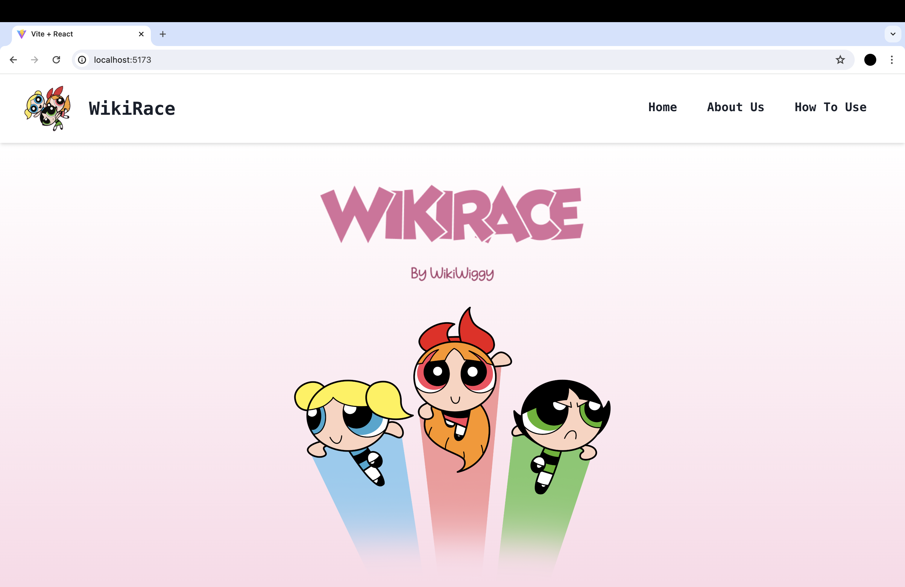
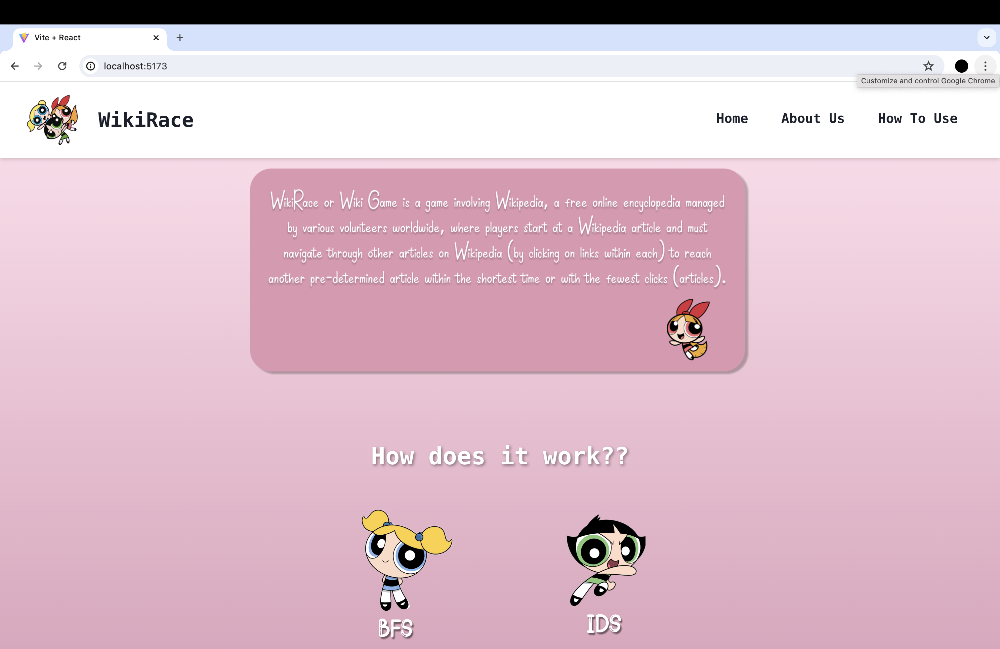
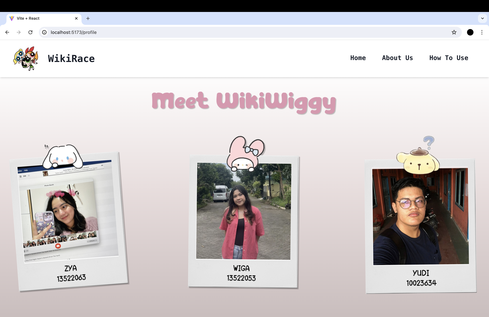
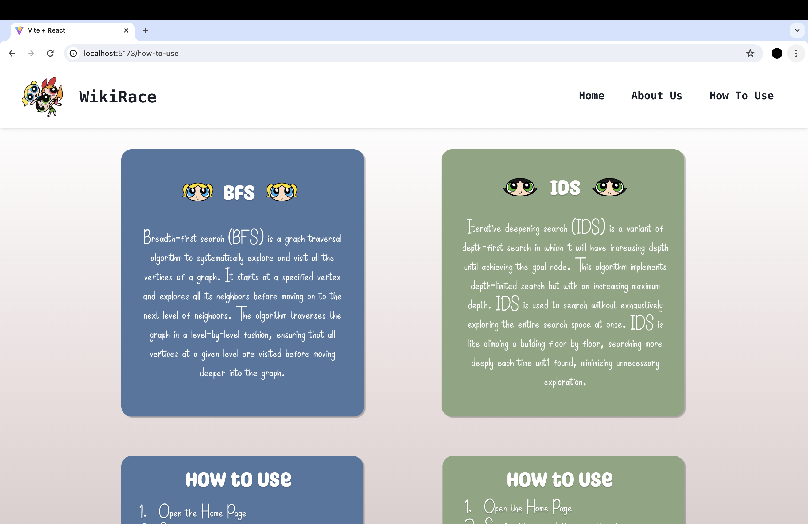
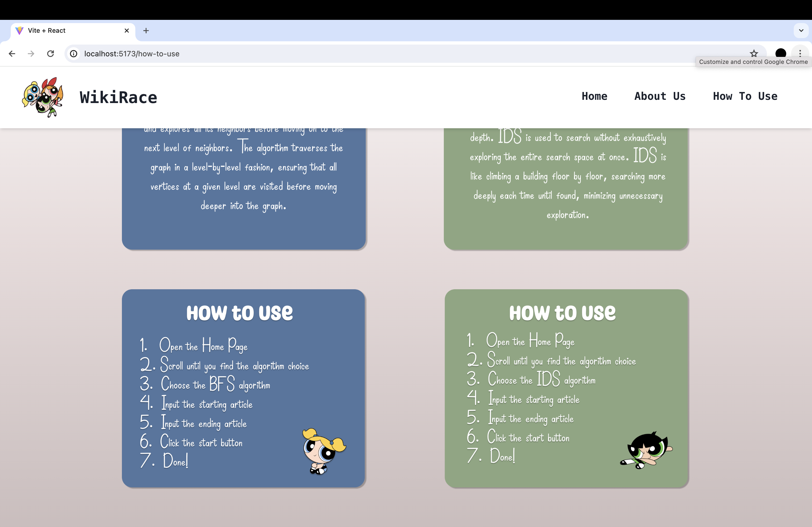
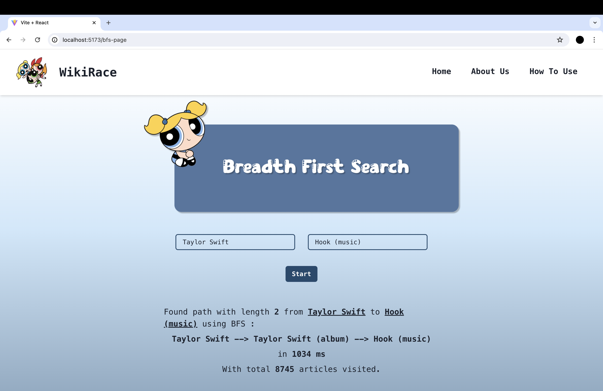
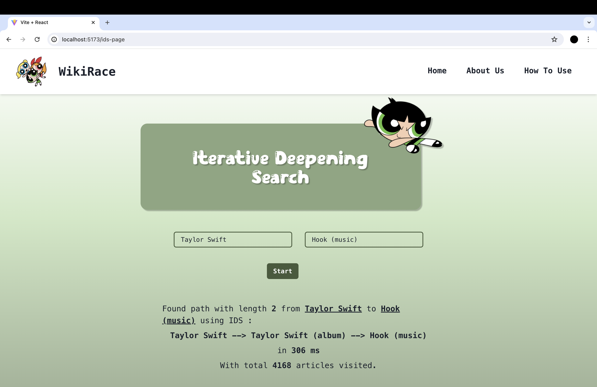

<h1 align="center"> Tugas Besar 2 IF2211 Strategi Algoritma </h1>
<h1 align="center">  Pemanfaatan Algoritma IDS dan BFS dalam Permainan WikiRace </h1>


## Table of Contents
1. [General Information](#general-information)
2. [Contributors](#contributors)
3. [Features](#features)
4. [Requirements Program](#required_program)
5. [How to Run The Program](#how-to-run-the-program)
6. [Project Status](#project-status)
7. [Project Structure](#project-structure)
8. [Screenshots](#screenshots)
9. [Bonus Video](#bonus-video)


## General Information
WikiRace or Wiki Game is a game involving Wikipedia, a free online encyclopedia managed by various volunteers worldwide, where players start at a Wikipedia article and must navigate through other articles on Wikipedia (by clicking on links within each) to reach another pre-determined article within the shortest time or with the fewest clicks (articles). This program uses 2 types of algorithm, Breadth First Search (BFS) and Iterative Deepening Search (IDS). BFS is a searching algorithm that searches a graph based on its level. IDS is a searching algorithm that will search the graph using Depth Limited Search and will constantly increase the depth limit until the goal is found.


## Contributors
### **Kelompok WikiWiggy**
|   NIM    |                  Nama                  |
| :------: | :------------------------------------: |
| 13522053 |       Erdianti Wiga Putri Andini       |
| 13522063 |         Shazya Audrea Taufik           |
| 10023634 |            Yudi Kurniawan              |


## Features
Features that used in this program are:
| NO  | Algorithm            | Description                                                          |
|:---:|----------------------|----------------------------------------------------------------------|
| 1   | BFS                  | WikiRace searching the path using Breadth First Search algorithm     |
| 2   | IDS                  | WikiRace searching the path using Iterative Depth Search algorithm   |


## Requirements Program
|   NO   |  Required Program                  |                           Reference Link                            |
| :----: | ---------------------------------- |---------------------------------------------------------------------|
|   1    | ChakraUI React                     | [ChakraUI](https://v2.chakra-ui.com/)                               |                            
|   2    | Go Language                        | [The Go Programming Language](https://go.dev)                       |
|   3    | React                              | [React](https://react.dev)                                          |
|   4    | Docker Desktop                     | [Docker](https://www.docker.com/products/docker-desktop/)           |


## How to Run The Program (Without Using Docker)
### Clone Repository
1. Open terminal
2. Clone this repository by typing `git clone https://github.com/wigaandini/Tubes2_WikiWiggy.git` in the terminal.
3. Change the directory using `cd src`.
### Run the Frontend
1. Change the directory using `cd Frontend`.
2. If you don't have the requirements, type `npm install` in terminal.
3. Install the ChakraUI by typing `npm i @chakra-ui/react @emotion/react @emotion/styled framer-motion`.
4. Compile and run the program by typing `npm run dev`.
5. Open the localhost link or type `o` in the terminal.
### Run the Backend
1. Open a new terminal
2. Change the directory using `cd Backend`.
3. If you don't have the requirements, type `go get github.com/PuerkitoBio/goquery` and  `go get github.com/gin-gonic/gin` in terminal.
4. To run BFS algorithm, type `cd bfs` then `go run ./bfs.go`.
5. To run IDS algorithm, open new terminal then type `cd ids` then `go run ./ids.go`.
6. If the terminal is terminated, don't forget to remove the csv file `cached-ids.csv` and `cached-bfs.csv` and repeat from step 4.
### How to use the Website
1. Open the home page and click BFS or IDS.
2. Input the start article title.
3. Input the goal article title.
4. Click the start button and wait for the results to appear.


## How to Run The Program (Using Docker)
### Clone Repository
1. Open terminal
2. Clone this repository by typing `git clone https://github.com/wigaandini/Tubes2_WikiWiggy.git` in the terminal.
3. To run the docker, open the `Docker Desktop` application.
4. Go back to terminal and type `docker-compose build` for building the docker.
5. Type `docker-compose up' to run the container.
6. Open `localhost:5173` in your browser.
7. Open the home page and click BFS or IDS.
8. Input the start article title.
9. Input the goal article title.
10. Click the start button and wait for the results to appear.
11. If the terminal is terminated, don't forget to remove the container in `Docker Desktop` and repeat from step 4.


## Project Status
This project has been completed and can be executed.


## Project Structure
```bash

│
├── README.md
│
├── docker-compose.yml
│
├── img
|   ├── 1.png
|   ├── 2.png
|   ├── 3.png
|   ├── 4.png
|   ├── 5.png
|   ├── 6.png
|   ├── 7.png
│   └── WikiWiggy.jpg
│
├── doc/                        # Document files
│   └── WikiWiggy.pdf
│
└── src/                        # Source code files
    ├── Backend/                
    │   ├── bfs
    │   │   ├── bfs.go
    │   │   ├── go.mod
    │   │   └── go.sum
    │   └── ids
    │       ├── ids.go
    │       ├── go.mod
    │       └── go.sum
    └── Frontend/                
        ├── data 
        ├── public
        ├── src
        │   ├── assets           # Pictures used in the website
        │   ├── layouts
        │   │   ├── MobileNavigation.jsx
        │   │   ├── NavigationBar.jsx
        │   │   └── RootLayout.jsx
        │   ├── pages
        │   │   ├── BFS.jsx
        │   │   ├── Dashboard.jsx
        │   │   ├── HowToUse.jsx
        │   │   ├── IDS.jsx
        │   │   └── Profile.jsx
        │   └── styles
        │       └── Profile.css
        ├── App.jsx
        ├── main.jsx
        ├── index.html
        ├── package-lock.json
        ├── package.json
        └── vite.config.js
                                   
        
```

## Screenshots









## Bonus Video
https://youtu.be/p_GyjQVEhv0